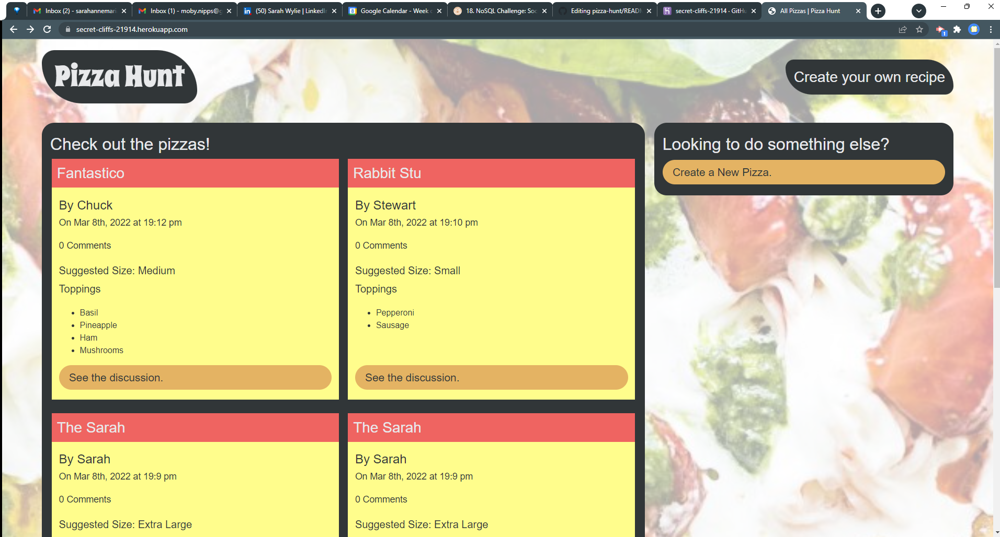

# Pizza Hunt

## Description
Do you love pizza? Are you excited by the idea of creating your own custom pizza, then connecting with others over their pizza creations? This is the app for you! 

## Table of Contents
* [Usage](#usage)
* [Output](#output)
* [Badges](#badges)
* [Queries](#any-questions)

## Usage
Head on over to the [Pizza Hunt app](https://secret-cliffs-21914.herokuapp.com/) to save your favorite creations, get ideas from other users, and enter a lively debate as to whether Brussel's Sprouts belong on a pizza. In the meantime, I think we can all agree that pineapple has no place in the pizza kitchen...

## Output:

### Badges

### Any Questions?
Contact [Sarah](https://github.com/sarahwylie) on GitHub

© 2022 by SarahWylie
